# ESP32XIAO-GitHub-Action

Badge Code
``

### Commands with Arduino-CLI
- arduino-cli list all
- arduino-cli lib install "Adafruit GFX Library"
- arduino-cli lib install "Adafruit SSD1306"
- arduino-cli compile --fqbn esp32:esp32:XIAO_ESP32C3 .
- arduino-cli upload -p /dev/ttyACM0 --fqbn esp32:esp32:XIAO_ESP32C3 .

## Videos
Playlist: https://www.youtube.com/playlist?list=PLluslK6uBf4tOir-zkFXTTtdfZk6BK0MW

## Alle Repos zur Serie
- https://github.com/pixelEDI/GitHubAction_ArduinoR4
- https://github.com/pixelEDI/GitHubAction_ESP32XIAO
- https://github.com/pixelEDI/GiteaAction_ArduinoR4
- https://github.com/pixelEDI/GIiteaAciton_pio_ESP32XIAO

```mermaid
graph TD

    A[GitHub] -->|Video 1| BB[GitHub Actions]
    BB --> BB2[CI/CD bei MCU]
    BB2 --> B[Action arduino/compile-sketches]
    B -->|Video 1| B1[Arduino CLI im Hintergrund]
    B1 --> B2[Verwendung vorgefertigter Action]
    B2 --> B3[Kompilierung eines Arduino R4 Sketches]
    B3 --> B4[Mit Libraries]
    
    B --> |Video 2| C[ESP32 Plattform]
    C --> C1[ESP32 Kompilierungen]
    C1 --> C2[Mit Libraries]
    C2 --> C3[Matrixfunktion für Mehrfachkompilierung C3/S3/C6]

    D[Gitea] --> |Video 3| D1[Self-hosted Runner Installation]
    D1 --> D2[Nachbau einer Aktion mit Bash]
    D2 --> D3[Arduino Sketch Kompilierung]
    
    D --> |Video 4| E1[Self-hosted Runner mit PlatformIO]
    E1 --> E2[Bash Kompilierung von ESP32-Dateien]
    E2 --> E3[Mit Libraries]

    style D stroke:#f96,stroke-width:2px
    style E1 stroke:#f96,stroke-width:2px
    style E2 stroke:#f96,stroke-width:2px
    style E3 stroke:#f96,stroke-width:2px

```

